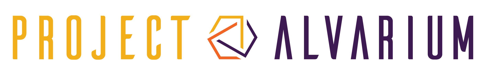

# Annotation Store Example (Golang)

This repository adapts the [SDK's multistage example](https://github.com/project-alvarium/go-sdk/blob/master/cmd/examples/multistage/main.go) on how to use the [annotation store](https://github.com/project-alvarium/go-store).
